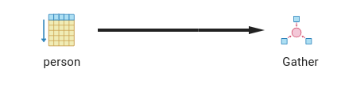

# B-Tree [OTDATED]

Created: June 20, 2023 3:59 PM
Owner: Din Lester
Tags: databases
Status: Done

# INDEXES

Resources:

- [https://www.enterprisedb.com/postgres-tutorials/overview-postgresql-indexes](https://www.enterprisedb.com/postgres-tutorials/overview-postgresql-indexes)
- [https://youtu.be/fsG1XaZEa78](https://youtu.be/fsG1XaZEa78)
- [https://youtu.be/-qNSXK7s7_w](https://youtu.be/-qNSXK7s7_w)
- [https://hakibenita.com/postgresql-hash-index](https://hakibenita.com/postgresql-hash-index)
- [https://habr.com/ru/articles/276973/](https://habr.com/ru/articles/276973/)
- [https://pganalyze.com/docs/explain/scan-nodes/bitmap-heap-scan](https://pganalyze.com/docs/explain/scan-nodes/bitmap-heap-scan)

Computer hardware:

memory         16GiB System memory
processor      Intel(R) Core(TM) i7-10750H CPU @ 2

PostgreSQL server provides following types of indexes, which each uses a different algorithm:

- B-tree
- Hash
- GiST
- SP-GiST
- GIN
- BRIN

Not all types of indexes are the best fit for every environment, so you should choose the one you use carefully. How you decide will depend upon your requirements

We have next DB:

```sql
CREATE TABLE IF NOT EXISTS public.person
(
id integer NOT NULL,
first_name character varying(255) COLLATE pg_catalog."default",
last_name character varying(255) COLLATE pg_catalog."default",
gender character varying(1) COLLATE pg_catalog."default",
birthday date,
CONSTRAINT person_pkey PRIMARY KEY (id)
)
```

And 40607301 rows inserted with 695 unique first_name and 1584 last_names 

Let’s try to make some queries on clean not-indexed DB:

```sql
select count(distinct last_name) from person; worked 36 secs 654 msec.
```

```sql
select id from person where first_name = 'Connie'; worked 928 msec.
```

```sql
select id from person where last_name = 'Martinez'; worked 867 msec.
```

```sql
select id from person 
where first_name = 'Connie' and last_name = 'Patterson'; worked 840 msec.
```

```sql
select * from person where birthday between '1992-03-20' and '1992-04-21';

"Gather  (cost=1000.00..545229.93 rows=152793 width=23) (actual time=33.612..881.623 rows=139727 loops=1)"
"  Workers Planned: 2"
"  Workers Launched: 2"
"  ->  Parallel Seq Scan on person  (cost=0.00..528950.62 rows=63664 width=23) (actual time=61.806..857.456 rows=46576 loops=3)"
"        Filter: ((birthday >= '1992-03-20'::date) AND (birthday <= '1992-04-21'::date))"
"        Rows Removed by Filter: 13489191"
"Planning Time: 0.071 ms"
"JIT:"
"  Functions: 6"
"  Options: Inlining true, Optimization true, Expressions true, Deforming true"
"  Timing: Generation 0.634 ms, Inlining 99.322 ms, Optimization 54.340 ms, Emission 30.998 ms, Total 185.294 ms"
"Execution Time: 886.409 ms"
```

```sql
select * from person where birthday = '1992-03-04'; worked 899 msec.
```

```sql
select * from person where first_name='Jeffrey' and last_name='Hunt' and birthday = '1986-04-05';
"Gather  (cost=1000.00..572250.00 rows=1 width=23) (actual time=901.782..907.475 rows=1 loops=1)"
"  Workers Planned: 2"
"  Workers Launched: 2"
"  ->  Parallel Seq Scan on person  (cost=0.00..571249.90 rows=1 width=23) (actual time=630.892..891.700 rows=0 loops=3)"
"        Filter: (((first_name)::text = 'Jeffrey'::text) AND ((last_name)::text = 'Hunt'::text) AND (birthday = '1986-04-05'::date))"
"        Rows Removed by Filter: 13535767"
"Planning Time: 0.097 ms"
"JIT:"
"  Functions: 6"
"  Options: Inlining true, Optimization true, Expressions true, Deforming true"
"  Timing: Generation 0.788 ms, Inlining 98.863 ms, Optimization 51.130 ms, Emission 32.590 ms, Total 183.372 ms"
"Execution Time: 907.673 ms"
```

```sql
select * from person 
where birthday between '1992-03-20' and '2020-04-21' 
and first_name='Connie' and last_name='Patterson';

"Gather  (cost=1000.00..614549.97 rows=8 width=23) (actual time=127.537..979.380 rows=36 loops=1)"
"  Workers Planned: 2"
"  Workers Launched: 2"
"  ->  Parallel Seq Scan on person  (cost=0.00..613549.17 rows=3 width=23) (actual time=112.319..961.853 rows=12 loops=3)"
"        Filter: ((birthday >= '1992-03-20'::date) AND (birthday <= '2020-04-21'::date) AND ((first_name)::text = 'Connie'::text) AND ((last_name)::text = 'Patterson'::text))"
"        Rows Removed by Filter: 13535755"
"Planning Time: 0.085 ms"
"JIT:"
"  Functions: 6"
"  Options: Inlining true, Optimization true, Expressions true, Deforming true"
"  Timing: Generation 0.721 ms, Inlining 102.751 ms, Optimization 54.766 ms, Emission 33.087 ms, Total 191.326 ms"
"Execution Time: 979.735 ms"
```

This is because without indexes we have to make full table scan:

```sql
explain analyze select id from person where first_name = 'Dustin';

"Gather  (cost=1000.00..490538.63 rows=28864 width=4) (actual time=3.124..894.644 rows=61070 loops=1)"
"  Workers Planned: 2"
"  Workers Launched: 2"
"  ->  Parallel Seq Scan on person  (cost=0.00..486652.23 rows=12027 width=4) (actual time=2.536..876.005 rows=20357 loops=3)"
"        Filter: ((first_name)::text = 'Dustin'::text)"
"        Rows Removed by Filter: 13515410"
"Planning Time: 0.111 ms"
"JIT:"
"  Functions: 12"
"  Options: Inlining false, Optimization false, Expressions true, Deforming true"
"  Timing: Generation 0.698 ms, Inlining 0.000 ms, Optimization 0.519 ms, Emission 6.886 ms, Total 8.103 ms"
"Execution Time: 896.984 ms"
```



The worst case is LIKE statement:

```sql
select last_name from person 
where first_name LIKE '%ara%'; worked 1 secs 337 msec.
```

```sql
select last_name from person where first_name LIKE '%a'; worked 4 secs 351 msec.
```

Keep in mind that id is indexed by default:

```sql
select first_name from person where id = 20432876; worked 29 msec.
```

### Let’s try to create B-TREE index on first_name

The most common and widely used index type is the **B-tree** index. This is the **default** index type for the CREATE INDEX command, unless you explicitly mention the type during index creation.

If the indexed column is used to perform the comparison by using comparison operators such as **<**, **<=**, **=**, **>=**, ****and **>**, then the  Postgres optimizer uses the index created by the B-tree option for the specified column.


****************************Concat indexes****************************


```sql
select id from person where first_name = 'Dustin';

"Bitmap Heap Scan on person  (cost=324.14..84412.70 rows=28864 width=4) (actual time=12.632..170.082 rows=61070 loops=1)"
"  Recheck Cond: ((first_name)::text = 'Dustin'::text)"
"  Heap Blocks: exact=54846"
"  ->  Bitmap Index Scan on person_first_name  (cost=0.00..316.92 rows=28864 width=0) (actual time=4.775..4.776 rows=61070 loops=1)"
"        Index Cond: ((first_name)::text = 'Dustin'::text)"
"Planning Time: 0.083 ms"
"Execution Time: 172.262 ms"
```

### Let’s try to create B-TREE index on birthday

 

```sql
select * from person where birthday = '1992-03-02';

"Bitmap Heap Scan on person  (cost=56.61..16826.32 rows=4667 width=23) (actual time=1.371..17.529 rows=4607 loops=1)"
"  Recheck Cond: (birthday = '1992-03-02'::date)"
"  Heap Blocks: exact=4581"
"  ->  Bitmap Index Scan on person_birthday  (cost=0.00..55.44 rows=4667 width=0) (actual time=0.590..0.591 rows=4607 loops=1)"
"        Index Cond: (birthday = '1992-03-02'::date)"
"Planning Time: 0.070 ms"
"Execution Time: 17.804 ms"
```

```sql
select * from person where birthday between '1992-03-20' and '1992-04-21';

"Gather  (cost=3094.57..444726.16 rows=152793 width=23) (actual time=34.586..535.695 rows=139727 loops=1)"
"  Workers Planned: 2"
"  Workers Launched: 2"
"  ->  Parallel Bitmap Heap Scan on person  (cost=2094.57..428446.86 rows=63664 width=23) (actual time=23.766..510.223 rows=46576 loops=3)"
"        Recheck Cond: ((birthday >= '1992-03-20'::date) AND (birthday <= '1992-04-21'::date))"
"        Rows Removed by Index Recheck: 3256168"
"        Heap Blocks: exact=15162 lossy=23292"
"        ->  Bitmap Index Scan on person_birthday  (cost=0.00..2056.37 rows=152793 width=0) (actual time=25.440..25.441 rows=139727 loops=1)"
"              Index Cond: ((birthday >= '1992-03-20'::date) AND (birthday <= '1992-04-21'::date))"
"Planning Time: 0.067 ms"
"JIT:"
"  Functions: 6"
"  Options: Inlining false, Optimization false, Expressions true, Deforming true"
"  Timing: Generation 0.875 ms, Inlining 0.000 ms, Optimization 0.442 ms, Emission 6.249 ms, Total 7.567 ms"
"Execution Time: 540.477 ms"
```

### Let’s talk about selectivity

We have next query on our table:

```sql
select * from person where gender = 'M';

"Seq Scan on person  (cost=0.00..782746.25 rows=20192657 width=23) (actual time=28.092..2909.585 rows=20309033 loops=1)"
"  Filter: ((gender)::text = 'M'::text)"
"  Rows Removed by Filter: 20298268"
"Planning Time: 0.167 ms"
"JIT:"
"  Functions: 2"
"  Options: Inlining true, Optimization true, Expressions true, Deforming true"
"  Timing: Generation 0.221 ms, Inlining 3.830 ms, Optimization 15.174 ms, Emission 9.072 ms, Total 28.298 ms"
"Execution Time: 3338.503 ms"
```

**Make B-TREE index**

This index is so useless, so POSTGRES planner choose full scan)

```sql
select * from person where gender = 'M';

"Seq Scan on person  (cost=0.00..782746.25 rows=20192657 width=23) (actual time=26.975..2916.798 rows=20309033 loops=1)"
"  Filter: ((gender)::text = 'M'::text)"
"  Rows Removed by Filter: 20298268"
"Planning Time: 0.051 ms"
"JIT:"
"  Functions: 2"
"  Options: Inlining true, Optimization true, Expressions true, Deforming true"
"  Timing: Generation 0.207 ms, Inlining 3.833 ms, Optimization 14.650 ms, Emission 8.460 ms, Total 27.151 ms"
"Execution Time: 3342.513 ms"
```

### Multiple fields in index

```sql
select id from person where first_name = 'Connie' and last_name = 'Patterson';
"Index Scan using person_first_last_name on person  (cost=0.56..64.86 rows=15 width=4) (actual time=0.021..0.181 rows=53 loops=1)"
"  Index Cond: (((first_name)::text = 'Connie'::text) AND ((last_name)::text = 'Patterson'::text))"
"Planning Time: 0.141 ms"
"Execution Time: 0.193 ms"
```

More about selectivity

**Created index** 

```sql
create index person_first_last_name_birthday 
on person(first_name, last_name, birthday);
```

```sql
select * from person 
where first_name='Connie' and last_name='Patterson' and birthday = '1992-03-02';

"Index Scan using person_first_last_name_birthday on person  (cost=0.56..8.59 rows=1 width=23) (actual time=0.018..0.019 rows=0 loops=1)"
"  Index Cond: (((first_name)::text = 'Connie'::text) AND ((last_name)::text = 'Patterson'::text) AND (birthday = '1992-03-02'::date))"
"Planning Time: 0.169 ms"
"Execution Time: 0.028 ms"
```

```sql
select * from person 
where first_name='Connie' and last_name='Patterson' and 
birthday between '1992-03-20' and '2020-04-21';

"Index Scan using person_first_last_name_birthday on person  (cost=0.56..36.76 rows=8 width=23) (actual time=0.021..0.054 rows=36 loops=1)"
"  Index Cond: (((first_name)::text = 'Connie'::text) AND ((last_name)::text = 'Patterson'::text) AND (birthday >= '1992-03-20'::date) AND (birthday <= '2020-04-21'::date))"
"Planning Time: 0.186 ms"
"Execution Time: 0.085 ms"
```

**********Created index**********

```sql
create index person_birthday_first_last_name 
on person(birthday, first_name, last_name);
```

```sql
select * from person where first_name='Jeffrey' and last_name='Hunt' and birthday = '1986-04-05';
"Index Scan using person_birthday_first_last_name on person  (cost=0.56..8.59 rows=1 width=23) (actual time=0.023..0.023 rows=0 loops=1)"
"  Index Cond: ((birthday = '1992-03-02'::date) AND ((first_name)::text = 'Connie'::text) AND ((last_name)::text = 'Patterson'::text))"
"Planning Time: 0.547 ms"
"Execution Time: 0.035 ms"
```

```sql
select * from person 
where birthday > '1992-03-20' and birthday < '2020-04-21' 
and first_name='Connie' and last_name='Patterson';

"Gather  (cost=1000.00..614549.97 rows=8 width=23) (actual time=196.996..973.382 rows=36 loops=1)"
"  Workers Planned: 2"
"  Workers Launched: 2"
"  ->  Parallel Seq Scan on person  (cost=0.00..613549.17 rows=3 width=23) (actual time=152.112..954.020 rows=12 loops=3)"
"        Filter: ((birthday > '1992-03-20'::date) AND (birthday < '2020-04-21'::date) AND ((first_name)::text = 'Connie'::text) AND ((last_name)::text = 'Patterson'::text))"
"        Rows Removed by Filter: 13535755"
"Planning Time: 0.179 ms"
"JIT:"
"  Functions: 6"
"  Options: Inlining true, Optimization true, Expressions true, Deforming true"
"  Timing: Generation 1.088 ms, Inlining 148.461 ms, Optimization 74.298 ms, Emission 40.129 ms, Total 263.976 ms"
"Execution Time: 973.807 ms"
```

[ADDITIONAL]

****************************************************************Normal representation of selects****************************************************************

We have this procedure for show mean time for select 1000 times

```sql
DO $$
DECLARE
  n INTEGER := 100000;
  duration INTERVAL := 0;
  start TIMESTAMP;
  first_names TEXT[];

BEGIN
  -- Fetch random keys from the table
  SELECT ARRAY_AGG(first_name) INTO first_names
  FROM (
    SELECT first_name
    FROM person
    ORDER BY random()
    LIMIT n
  ) AS foo;

    FOR i IN array_lower(first_names, 1)..array_upper(first_names, 1) LOOP
      start := clock_timestamp();
        PERFORM * FROM person WHERE first_name = first_names[i];
      duration := duration + (clock_timestamp() - start);
  END LOOP;
  RAISE NOTICE '{TYPE OF SCAN HERE}: mean=%', extract('epoch' from duration) / n;
END;
$$;
```

First name

Sequence scan: mean=2.7447613120000000

B-Tree scan: mean=0.72053070000000000000

Birthdays here 100 select

Sequence scan: mean=1.1220963900000000

B-Tree scan: mean=0.01109847000000000000

### Bitmap scans

The idea behind a bitmap scan is that a single block is only used once during a scan. It can also be very helpful if you want to use more than one index to scan a single table.

