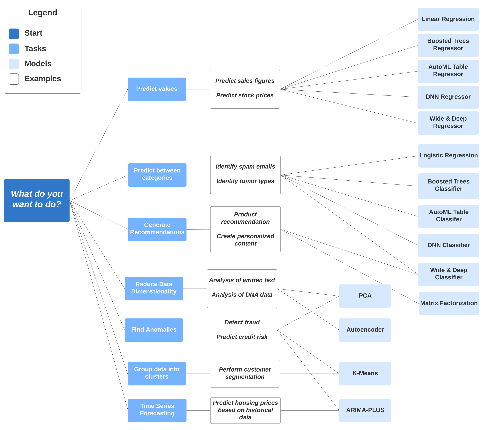
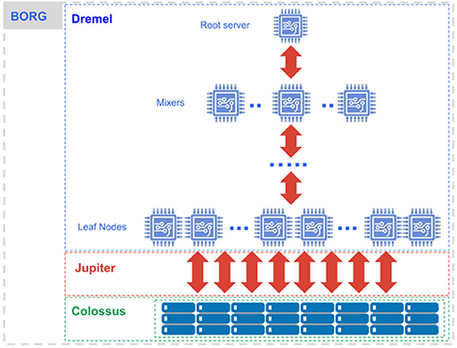

BigQuery is cloud-based data warehouse.

You can think of it as a column-oriented database.

## Structure

![[Pasted image 20231204102849.png]]

But not every dataset sees each other (notice dataset on the right is separated). Why?

## Regions
That's why
Each dataset is tied to specific region. You can't change it. 

"Multi-region" datasets is a thing, but it doesn't mean you will be able to access data across regions anyway.

Why regions?
- Data locality optimizations
	- in BQ itself
	- across services
	- across cloud (BigQuery Omni)
- Pricing
- Legal reasons (i.e. GDPR)

## Speedrun
1. Language - GoogleSQL. Not too different from SQL in Postgres, for example. Maybe except for nested fields, ML and specific stuff like `APPROX_COUNT_DISTINCT`
2. Data types - literally all. Default INTEGER/STRING/FLOAT with various subtypes, as well as ARRAY, JSON, BYTES, STRUCT, GEOGRAPHY and so on.
3. Querying across datasets - Yes.
4. Querying across regions - No.
5. Views - available
	1. logical
	2. materialized
6. Routines - stored procedures / user-defined functions
7. Connections - query data outside BQ (S3, Spanner, Cloud SQL). Also you can run stored procedures for Apache Spark.
8. Scheduled queries - self-explanatory. If SELECT query, you can set destination table and append or overwrite data.
9. Data transfers - move data from certain sources into BQ. Can be scheduled for regular exports.
	1. Cloud storage (incl. AWS and Azure)
	2. Teradata DWH, Amazon Redshift
	3. But most importantly - Google Ads, Google Analytics, Youtube
	4. Also, move data across different regions datasets in BQ itself
10. Analytics Hub - share data by creating Shared datasets. Use case - share subset of data about historical sales cycles, share with supplier (3rd party), data analyst on supplier's side will analyze data to predict future sales and optimize logistics.
11. Dataform - data pipelines with version control, scheduling and logging.
12. Partner Center - marketplace for 3rd party integrations. BI/AI/ETL/dashboards etc.
13. BigQuery ML - create and run ML models. Some models are built-in (like linear regression)
		
14. Pricing - no flat rate. Everything is billed (query, compute, storage, data transfer etc), every operation has it's own limits/pricing models. But basically you pay for every move. Except COPY! COPY is free :)

## Under the hood
The core goal of BQ is to execute Big analytical Query sub-minute.

This is achieved with Dremel and Colossus. 

Basically the idea is that each compute node accesses only a subset of data by downloading X small files from distributed storage. 

Dremel - smart query execution engine optimized for aggregation queries in columnar data across thousands of execution nodes.

Colossus - distributed file system. Something like HDFS. It powers Google's BigQuery, Cloud Storage, Cloud SQL etc.

Jupiter - networking solution that Google uses in their data centers. Fun fact: they have own custom communication protocol. 

Borg - job scheduler.

Sources:
1. BigQuery under the hood. https://cloud.google.com/blog/products/bigquery/bigquery-under-the-hood
2. (Jupiter) A look inside Google’s Data Center Networks. https://cloudplatform.googleblog.com/2015/06/A-Look-Inside-Googles-Data-Center-Networks.html
3. Colossus under the hood. https://cloud.google.com/blog/products/storage-data-transfer/a-peek-behind-colossus-googles-file-system
4. Colossus presentation (spindle). https://www.pdsw.org/pdsw-discs17/slides/PDSW-DISCS-Google-Keynote.pdf