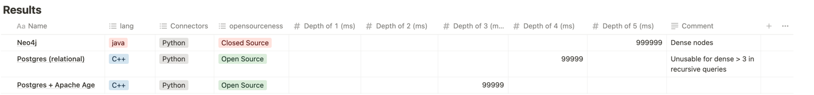

Compare Neo4j and Postgres (and Apache Age) performance for simple Friends-of-Friends query.

- `generate` folder contains Python scripts for generating fake data - 1 million nodes and random number of edges
  between them (turned out to be 18.8 million edges for test generation)
- `import` folder contains commands to import this data into Neo4j/Postgres/Age
- `read` folder contains commands to perform the same logical query (friends of friends)

Note that for proper comparison, hash index must be created in Postgres and lookup index in Neo4j for field "uid".

Results: Postgres fails miserably for "Firends-of-Friends" query of depth 5, while Neo takes almost 11 seconds to
perform it (using APOC library). Apache Age is basically unusable because of bugs and incompatibility with Neo4j-style
Cypher syntax (might be also a bug)

# Info from Notion



Neo4j

```sql
MATCH q=(n:Person {uid: 790443})-[*1..2]-(m:Person)
RETURN DISTINCT m
```

Neo4j (apoc)

```sql
MATCH (p:Person {uid: 5})
CALL apoc.path.subgraphNodes(p, {
	relationshipFilter: "FRIENDS_WITH",
    minLevel: 1,
    maxLevel: 5
})
YIELD node
RETURN node;
```

Postgres

```sql
WITH recursive cte AS (SELECT friend_a_uid, friend_b_uid, 1 as rec_depth
                       FROM friendship
                       WHERE friend_a_uid = 790443
                          or friend_b_uid = 790443

                       UNION ALL

                       SELECT DISTINCT
ON (f.friend_a_uid, f.friend_b_uid) f.friend_a_uid, f.friend_b_uid, cte.rec_depth+1
FROM cte
    JOIN friendship as f
ON
    (f.friend_a_uid = cte.friend_a_uid or f.friend_a_uid = cte.friend_b_uid
    or f.friend_b_uid = cte.friend_a_uid or f.friend_b_uid = cte.friend_b_uid)
WHERE cte.rec_depth + 1 <= 4
    )
SELECT DISTINCT id
FROM (SELECT friend_a_uid as id
      FROM cte
      UNION
      SELECT friend_b_uid as id
      FROM cte) as tmp
WHERE id <> 790443;
```

Age

```sql
LOAD
'age';
SET
search_path = ag_catalog, "$user", public;
SELECT *
FROM cypher('persons', $$
                           MATCH q = (n:Person {uid: 790444}) -[]->(m:Person)
    RETURN DISTINCT m
    UNION
    MATCH q=(n:Person {uid: 790444})<-[]-(m:Person)
    RETURN DISTINCT m
    $$) as (friends agtype);
```

Useful links:

- Fast import to PG using COPY https://www.postgresql.org/docs/current/populate.html#POPULATE-COPY-FROM
- Fast import to Apache Age + example queries https://github.com/apache/age/blob/master/regress/sql/age_load.sql
- PG shared memory explained https://stackoverflow.com/questions/32930787/understanding-postgresql-shared-memory
- APOC path algorithms https://neo4j.com/docs/apoc/current/overview/apoc.path/
- https://github.com/neo4j/apoc
- Emails about what is “True” OOP http://userpage.fu-berlin.de/~ram/pub/pub_jf47ht81Ht/doc_kay_oop_en
- Pregel paper https://www.dcs.bbk.ac.uk/~dell/teaching/cc/paper/sigmod10/p135-malewicz.pdf
- Presentation with Pregel example for shortest path in graph http://zhenxiao.com/read/Pregel.ppt