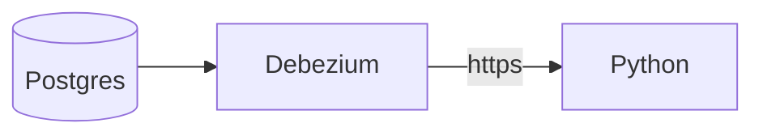

# What is CDC
CDC or Change Data Capture is an approach that detects, captures, and forwards only the modified data from a source system into downstream systems. What does it mean? 

Let's say we have OLTP database (Postgres) for backend, and we also have Text Index (Elastic)  for searching and Lakehouse (Delta Lake or just some parquet files in s3) for analysis. _Each of these has its own copy of the data, stored in its own representation that is optimized for its own purposes_. So now is the question: how can we replicate/sync data from OLTP (our source of truth) to other systems? 
> [!question]- What replication options do we have? What are pros and cons?
> Full data database copy in a batch process. E.g. some daily ETL that takes data from Postgres and uploads it to s3
> 1. ✅ Simple and robust
> 2. ❌ Slow
> 3. ❌ We are missing changes that are happening between the copies
> 4. ❌ if data is not changing frequently we just copying the same data over and over again
> 
> Dual writes
> 5. ✅  Almost real-time data
> 6. ❌ Complicated solution, can increase backend application latency
> 7. ❌ Data inconsistency due to
> 	1. Race condition
> 	2. One of writes can fail (e.g. we updated data data in Postgres, but Elastic update failed)
> So the problem if really similar to the database replication for horizontal scaling: with double writes we have multiple "masters" (Postgres and Elastic) and it is difficult to sync data between them. In practice, to sync them we can create our own "master" on application level that will manage this
> 
> Or maybe we can have only 1 master, and other masters will be followers/subscribers of these master...
> ![[Pasted image 20251026223859.png]]


So we can capture changes in Postgres (using different techniques) and send them IN CORRECT ORDER to downstream systems, and those systems can read and apply changes IN CORRECT ORDER. So it's just a producer-consumer system. That's why tools like Kafka are commonly used for CDC

 CDC event for the update of a record typically contains the entire new version of the record, so the current value for a primary key is entirely determined by the most recent event for that primary key, and log compaction can discard previous events for the same key. 
 On the other hand, with event sourcing, events are modeled at a higher level: an event typically expresses the intent of a user action, not the mechanics of the state update that occurred as a result of the action. In this case, later events typically do not override prior events, and so you need the full history of events to recon‐ struct the final state. Log compaction is not possible in the same way

# Types of CDC
So how can we capture/retrieve changes from our OLTP db?

One of the options is to use **triggers**. We can create triggers on update events for tables we are most interested in (e.g. `customer`) and write those changes to another table (e.g. `customer_audit`). However, triggers tend to be fragile (difficult to handle schema changes) and have significant performance overheads

Also, if we have any version or timestamp columns we can run a query that will only get rows, that was updated since the last run. But it is very similar to batch upload, because we are running the query with some intervals. So I don't think we can consider this CDC, even though articles mention it.

We could also use internal database transaction logs to identify changes instantly as they occur. This method is highly efficient because it operates at a low level, capturing changes with minimal disruption to the production system. As I understand it is the way Debezium (and most modern CDC tools) works

In any of these cases we would need to do initial snapshot of the data, and start tracking changes after it.

# CDC tools
1. [Debezium](https://debezium.io/)
2. [Flink CDC](https://github.com/apache/flink-cdc) (also based on Debezium) 
3. [Airbyte CDC](https://docs.airbyte.com/platform/understanding-airbyte/cdc) (probably based on Debezium)
4. Build-in (CocroachDB or DynamoDB built-in CDC) and cloud solutions (AWS migration service, Fivetran CDC)

# Debezium
[Debezium Architecture](https://debezium.io/documentation/reference/3.4/architecture.html) doc.

# Let's test it
There is no built-in way to directly write changes from Debezium to local filesystem, so I came up with this janky architecture:

There is a way to use Debezium engine directly in your Java application, but I was not in the mood to write Java app (and will never be) so decided to use Debezium Server (to avoid Kafka) with built-in [HTTP Client Sink](https://debezium.io/documentation/reference/stable/operations/debezium-server.html#_http_client) 


```bash
podman machine start
export DOCKER_HOST=unix://$(podman machine inspect --format '{{ .ConnectionInfo.PodmanSocket.Path }}')
export DOCKER_API_VERSION=1.41


docker compose up -d

# Show all running containers
podman ps

# Healthcheck
podman logs postgres --tail 20
podman logs debezium-server --tail 20
podman logs py --tail 20

# After that open http://0.0.0.0:8000
# Should see one more log in
podman logs py --tail 20


# More healthchecks
podman exec -it postgres psql -U dbz -d appdb -c "\conninfo"
podman exec -it debezium-server curl -s http://localhost:8080/q/health | jq

# Check if Debezium is connected to postgres
podman exec -it pg psql -U dbz -d appdb -c "SELECT slot_name, active, restart_lsn FROM pg_replication_slots;"

```

What does the last command check? [pg_replication_slots](https://www.postgresql.org/docs/9.4/catalog-pg-replication-slots.html) is a view that shows [replications slots](https://www.postgresql.org/docs/9.4/warm-standby.html#STREAMING-REPLICATION-SLOTS) 
> Replication slots provide an automated way to ensure that the master does not remove WAL ([Write-Ahead Logging](https://www.postgresql.org/docs/current/wal-intro.html)) segments until they have been received by all standbys, and that the master does not remove rows which could cause a [recovery conflict](https://www.postgresql.org/docs/9.4/hot-standby.html#HOT-STANDBY-CONFLICT) even when the standby is disconnected.

After that I've connected to my Postgres via IntelliJ and created new table `customers` 

```sql
CREATE TABLE public.customers(
  id SERIAL PRIMARY KEY,
  name TEXT,
  email TEXT
);
-- makes UPDATE/DELETE payloads include full row if no PK change
ALTER TABLE public.customers REPLICA IDENTITY FULL;
```

But at this time debezium container failed...

It was a long journey with some back-and-force between my FastAPI app and Debezium config file. In the end I've found that Debezium is trying to update to HTTP2, but FastAPI/Uvicorn doesn't support it (?) so Cursor added NGinx as a reverse proxy to convert HTTP/2 to HTTP/1.1. Okay, now we can check our data!!!

Run all containers again, wait some time and check `event.log` file. You can run next command in the separate terminal: 
```bash
podman exec -it py sh -c "tail -f /app/events.log" 
```
Also check FastAPI logs 
```bash
podman logs py --follow
```


# My thoughts
CDC is not a well-defined and polished architecture that you can just apply, and there is no simple end-to-end solutions (except cloud once that will cost a lot). CDC is more about the approach that you can use, adapt or sometimes even develop from scratch based on your needs. But it is really powerful and can unlock a lot of possibilities for your data infrastructure.

# Sources
1. [[Designing Data-Intensive Applications The Big Ideas Behind Reliable, Scalable, and Maintainable Systems ( PDFDrive ).pdf]] Chapter 11
2. Datacamp article about CDC https://www.datacamp.com/blog/change-data-capture
3. Debezium examples https://github.com/debezium/debezium-examples/tree/main
4. List of available sinks on Debezium Server https://debezium.io/documentation/reference/operations/debezium-server.html#_sink_configuration
5. Example of custom Debezium Server (for Apache Iceberg in this case) https://github.com/memiiso/debezium-server-iceberg